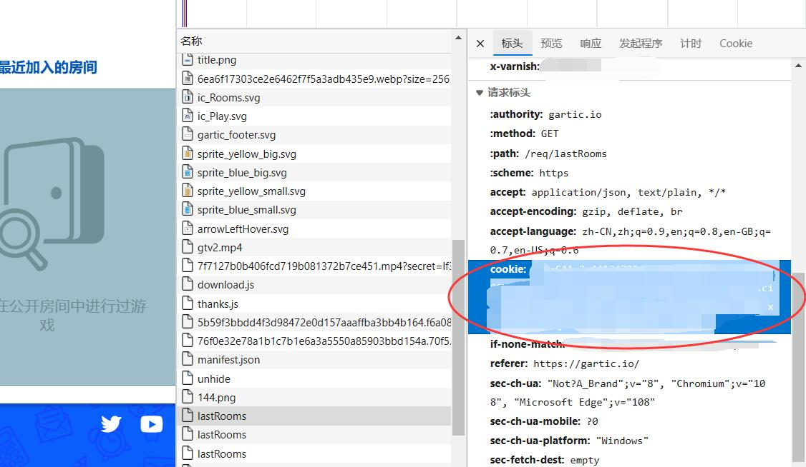

# gartic-word-importer

- 从txt批量导入词库到gartic
- 网址: [https://gartic.io](https://gartic.io)


# 环境要求

- Python 3.8+
- `pip install requirements.txt`

```
requests>=2.28.1
```


# 使用方法

- 准备好你自己的词库，词语一行一个
- 登录 [Gartic](https://gartic.io), 按下 `F12` ，进入 `网络`/`Network` 标签页，复制你的cookie




- 运行 `main.py`

```shell
python main.py
```

- 之后根据脚本提示自行操作即可
